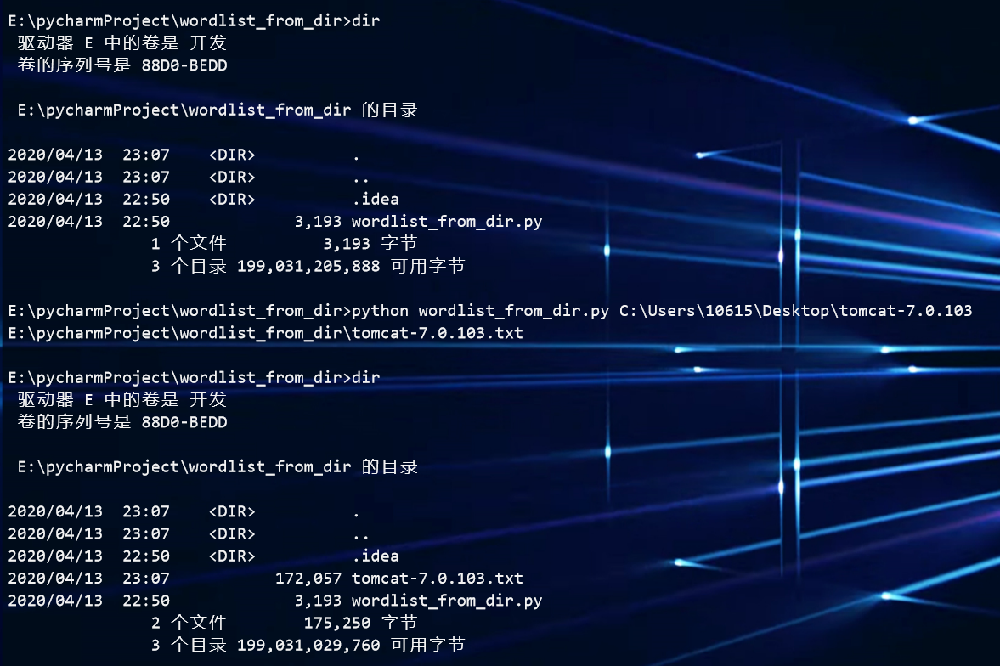
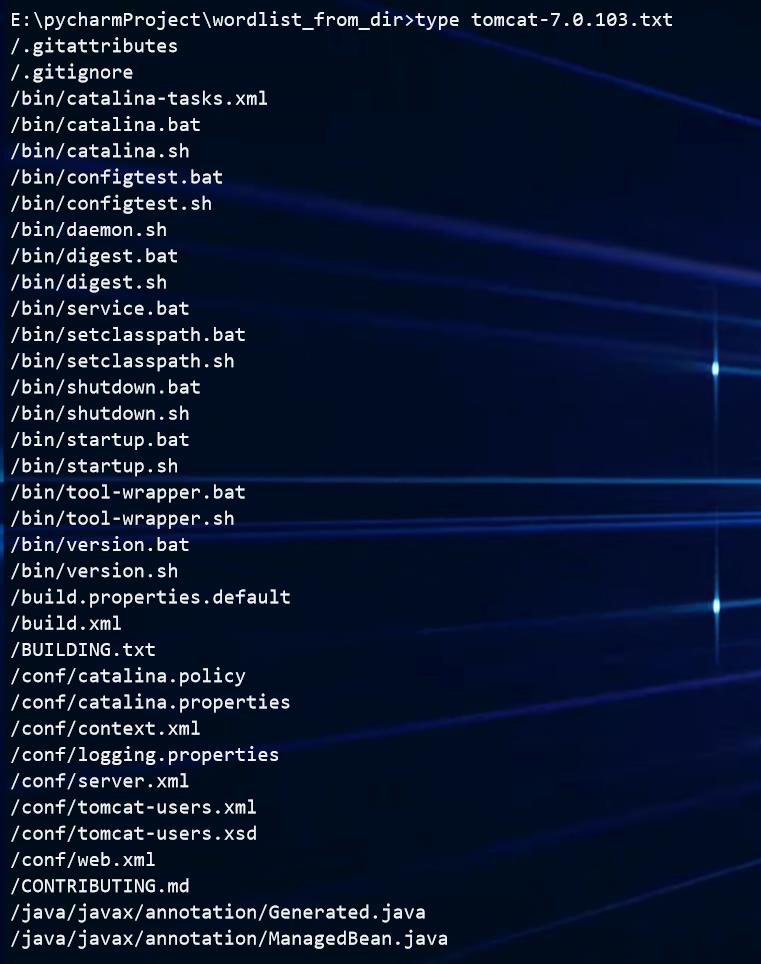

## wordlist_from_dir

一款根据文件夹制作字典的工具,获取文件夹内所有文件路径的工具。

渗透测试中识别出web指纹为tomcat，确没有好用的web目录爆破字典？使用这款工具将下载好的Tomcat目录生成tomcat专用的目录字典，以期望发现web的隐藏目录。

##### 使用

```
python wordlist_from_dir.py dirpath（如果没有路径参数，默认为脚本当前所在目录路径）
```



##### 效果
